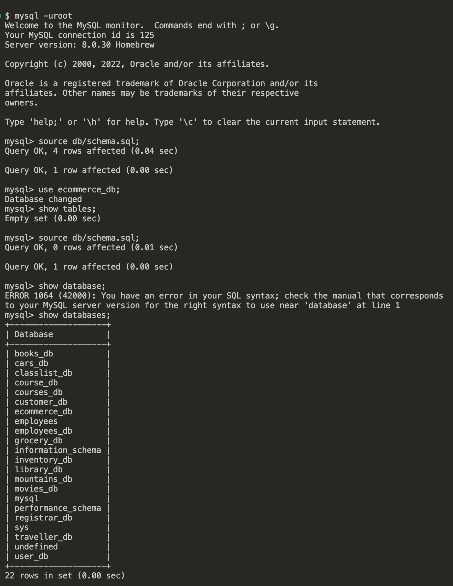
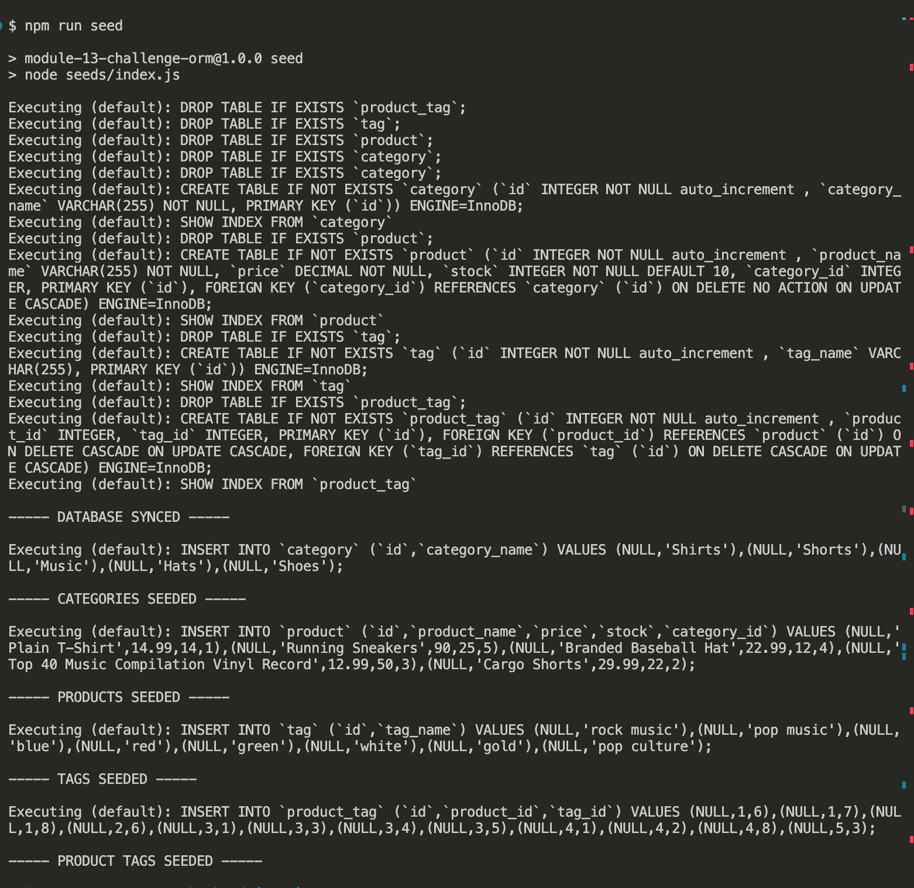
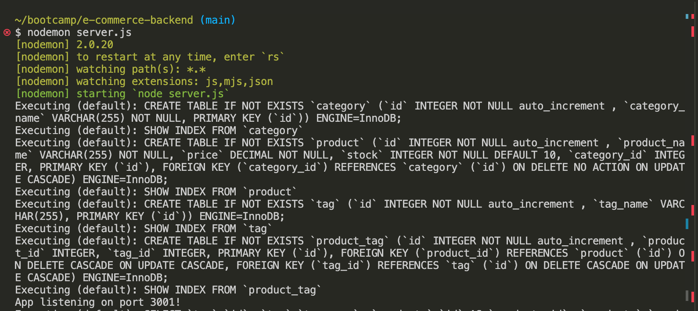
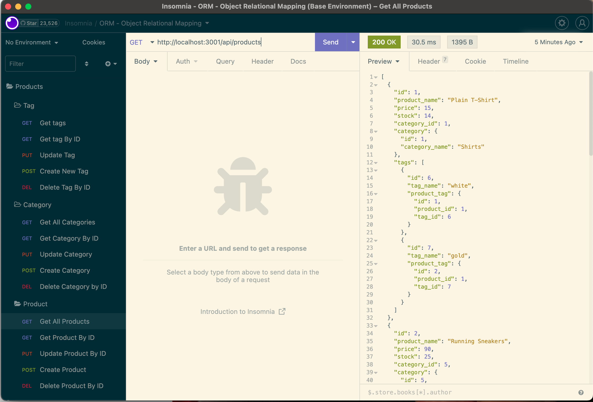

# E-commerce-backend
E-commerce application focusing on Backend.
## Table of Contents
1. [Descriptions](#descriptions)
2. [Installations](#installations)
3. [Usage](#usage)
4. [Test](#test)
5. [Contributing](#contributing)
6. [Link](#link)

## Descriptions
E-commerce is a type of business that is highly on demand right now. Backend portion of this app allows the user to keep track, modify (update, create, delete) of the product stocks. 

## Installations
The following installations are required to run the application.

To connect Express.js API to a MySQL database.
```pip
  npm install -save mysql

  npm install sequelize
```

To use environment variables to store sensitive data (for example; MySQL username, password, and database name).
```pip
  npm install dotenv
```

## Usage
There are two parts where we will be operating on. The process starts in the  terminal by using the following command line. 

To create the schema from the MySQL shell.
```pip
  mysql -u root

  source schema.sql;
```


To seed the database.
```pip
  npm run seed
```


To start the applications server
```pip
  npm run watch
```
OR 
```pip
  nodemon server.js
```


Once the server is connected the data for each routes can be tested in Insomnia API and will be displayed in a formatted JSON.

Example of data testing in product routes. 



## Contributing 

My instructor Mr.Anthony Cooper and Slack Learning Support Team.

## Link

You can click the following link for the walkthrough video of the e-commerce backend application.

[Walkthrough Video](https://watch.screencastify.com/v/YBc5w1b4MJgEw7VjBBk9)


